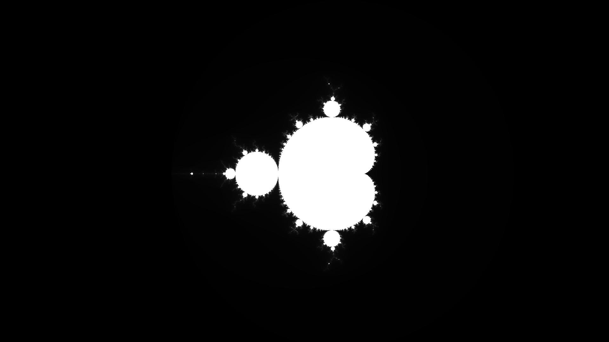

<div align="center">
  <h1>Mandelbrot Set</h1>
</div>

A Java application that renders the beautiful and infinite Mandelbrot set fractal in real-time using Swing.

## What is the Mandelbrot Set?

The Mandelbrot set is one of the most famous fractals in mathematics. It's defined by a simple iterative formula:

```
z(n+1) = z(n)² + c
```

Where `z` and `c` are complex numbers. The set consists of all complex numbers `c` for which the sequence does not diverge. This simple rule creates infinitely complex and beautiful patterns at every zoom level.


